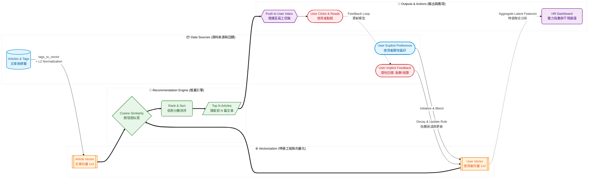

# AffecCare 文章推薦系統分析報告

本報告基於 AffecCare 系統 codebase 分析，詳細說明文章推薦機制的運作原理、使用者行為回饋處理，以及 HR 端如何應用此系統。

## 一、 推薦系統核心機制 (推薦文章給使用者的原理)
系統採用基於內容與使用者行為的 **內容過濾與協同混合概念 (Content-based & Behavior Vector)**。
1. **維度定義**：文章標籤被對應到 3 個核心維度 (`VECTOR_DIM=3`)：`壓力與情緒` (dim 0)、`職場與職涯` (dim 1)、`身心與生活` (dim 2)。
2. **向量化**：每篇文章會根據其標籤被轉換為一個正規化後的 3D 向量。使用者也有一個對應的 3D 偏好向量 (`user_vector`)。
3. **推薦計算**：當需要推薦時，系統會計算 `user_vector` 與所有文章向量的**餘弦相似度 (Cosine Similarity)**，並根據相似度分數由高至低排序，挑選分數最高的前 N 篇 (Top N) 推薦給使用者。

## 二、 使用者偏好與行為回饋

### 1. 使用者未選擇 Preferred Category 會怎麼樣？
如果使用者沒有選擇偏好分類（或是資料庫中找不到紀錄），系統會賦予一個**預設的平衡向量 (`INITIAL_VECTOR = [0.33, 0.33, 0.33]`)**。這意味著系統初期會平均地推薦各類型的文章，以維持多樣性，並透過後續的行為來逐步學習使用者的真實偏好。

### 2. 使用者重新選擇了 Preferred Category 會怎麼樣？
當使用者重新選擇分類時（觸發 `set_initial_user_vector`）：
* 系統會將新選擇的分類給予高權重 (0.8)，其他保留基本權重 (0.1) 作為 `target_vector`。
* **不會直接抹除過去的互動紀錄**：系統採用混合策略 (Blend)，將使用者現有的向量與新的 `target_vector` 進行 50% / 50% 的加權平均，以達到平滑過渡 (Smooth transition)，既尊重使用者的新選擇，也保留過去的隱性行為資料。

### 3. 使用者按讚 (Like) 或倒讚 (Dislike) 會怎麼樣？
按讚與倒讚是微調使用者偏好向量的關鍵指標：
* **按讚 (Like)**：該文章的標籤特徵會產生正向影響 (`LIKE_DELTA = 0.3`)。
* **倒讚 (Dislike)**：產生負向影響 (`DISLIKE_DELTA = 0.2`)。
* **衰減機制**：更新時，舊的向量會先乘上衰減係數 (`DECAY_RATE = 0.95`)，然後加上/減去文章影響力，接著確保數值不為負 (截斷至 0.01) 並重新正規化。
* **積分獎勵**：給予回饋的使用者會獲得積分獎勵（預設 10 分），鼓勵員工持續參與。

## 三、 HR 管理與應用

### 1. HR 可以看到什麼數據？
HR Dashboard 提供了豐富且即時的數據聚合分析：
* **全公司總覽 (Overview)**：包含 EAP 活躍使用率 (Engagement Rate)、公司壓力指數 (Stress Index，點擊壓力類文章佔比)、高風險人數 (頻繁點擊壓力文章人數)。
* **各部門統計**：各部門的使用率、總點擊次數以及該部門的「最熱門分類」。
* **趨勢分析 (Trends)**：過去 6 週各分類文章的點擊折線趨勢。
* **員工洞察與警示 (Employee Insights)**：將員工依部門及偏好分類分群 (Cohorts)，分析該群體的：
  * **壓力等級 (Stress Level)**：High / Medium / Low。
  * **活躍狀態與採用率**。
  * **系統建議 (Interventions)**：系統會針對「壓力過載」或「資源宣導斷層」的群體自動產生行動建議（例如：立即派發「情緒覺察」推播、安排主管一對一 Check-in）。
* **模型成效與回饋榜**：追蹤推薦準確率 (按讚佔比)、最後訓練時間、員工回饋積分排行與獎勵兌換狀況。

### 2. 系統如何幫助 HR 加快電子報/推播的發送？
* **一鍵智慧推播 (`push-recommendations`)**：HR 不再需要人工挑選文章並編排電子報。只需透過介面選擇「全體員工」或「特定部門」，點擊推播，系統便會為**每一位員工即時計算其專屬的 Top N 推薦文章**，並自動發送到員工的系統 Inbox 內。大幅降低作業時間並實現真正的個人化關懷。

### 3. 下次 HR 再按下推薦，會不會推到看過的文章？
**會的，目前系統架構會推薦看過的文章。**
* 根據目前的演算法實作，系統僅純粹比對向量餘弦相似度並取最高分，**並未實作「已讀過濾 (Read Filter)」或「已推播過濾」的機制**。
* 如果使用者的行為向量沒有因為新的點擊或按讚產生足夠的偏移，且資料庫中沒有新增更符合其向量的文章，HR 再次推播時，高機率會出現與上次相同的高分文章。
* *建議優化方向*：可在推薦過濾邏輯中加入 `ClickLog` 或 `InboxMessage` 的比對，將已推播或已閱讀文章的分數進行懲罰 (Penalty) 或是直接排除。

## 四、 策略與市場定位

### 1. 權重數字 (0.8 與 0.1) 是如何進行選擇的？
在系統初始化或員工重新選擇偏好時，系統將目標向量設定為偏好項目 `0.8`、其餘項目 `0.1`。這是一種常見的啟發式 (Heuristic) 設定：
* **強烈傾向，但不至絕對 (避免 Filter Bubble)**：如果給予 `1.0` 和 `0.0`，會導致推薦系統過度專注於單一分類，抹殺了使用者探索其他潛在需求（如隱性壓力管理）的可能性。
* **保留多樣性與學習空間**：賦予非首選分類 `0.1` 的基本權重，確保系統在計算餘弦相似度時，仍有機會推薦具備複合標籤的文章。這種設計讓系統得以在滿足當下偏好的同時，保留測試其他興趣的彈性，一旦使用者對其他分類文章產生互動（如點擊、按讚），系統就能敏捷地捕捉並調升該維度。

### 2. 是否有類似的競爭產品？我們的獨特優勢為何？策略為什麼會比別人更好？
市場上現有的企業員工協助方案 (EAP) 或健康管理平台（例如：Modern Health、Lyra Health），或是一般的企業電子報系統，通常依賴以下幾種模式：
* **靜態/分眾電子報**：HR 人工整理文章，全公司或全布門發送同一份內容，缺乏細顆粒度的個人化。
* **問卷驅動 (Survey-driven)**：僅依賴入職或年度的健康問卷進行一次性分類，難以反映員工日常波動的情緒狀態。
* **我們的獨特優勢 (動態行為推薦) 與策略優越性**：
  1. **隱性回饋即時學習**：相較於競品依賴填寫冗長表單，我們透過輕量級的「按讚/倒讚」與「點擊」等無阻力互動，動態微調 (Decay & Update) 使用者偏好向量，更真實反映當下心理需求。
  2. **HR 決策一體化**：多數推薦系統對管理者而言是黑盒子，但我們將個人化的推薦結果**反向聚合**成 HR Dashboard 上的「群體壓力等級」與「干預建議 (Interventions)」，讓 HR 能看見組織情緒趨勢並主動介入，將單向的內容遞送轉化為雙向的管理工具。
  3. **平滑過渡機制**：我們獨特的 50/50 Blend 演算法，在使用者主動更改偏好時，不會粗暴地洗掉過去的行為特徵，這比許多非黑即白的推薦系統更貼近人類複雜且漸進的心理狀態變化。

### 3. 給內部人員：如何驗證是否有文章推薦需求？
在進一步投入資源擴張前，建議內部團隊透過以下指標進行產品需求與價值驗證 (Validation)：
1. **A/B 測試 (A/B Testing)**：
   * **控制組**：由 HR 統一派發的傳統固定內容電子報（或是隨機推薦）。
   * **實驗組**：使用 `push-recommendations` API 自動推播的個人化推薦信件。
   * **驗證指標**：比較兩組的 **開信率 (Open Rate)**、**點擊率 (CTR)** 與 **單篇文章停留/閱讀時間**。若實驗組顯著較高，即證實個人化推薦能精準打中員工需求。
2. **回饋參與度 (Feedback Engagement) 與積分兌換**：
   * 觀察「點數獎勵機制」下的按讚/倒讚率。如果互動率（Model Performance 中的 Engagement Rate）保持穩定或攀升，代表員工對於「掌控自己看什麼內容」有強烈意願。
3. **質化回饋與 HR 效能盤點**：
   * **時間成本盤點**：記錄 HR 過去排版、挑選文章發送電子報的時間，對比現在使用「一鍵推播」的時間差，量化系統帶來的效率提升。
   * **管理價值驗證**：追蹤 Dashboard 建議：觀察 HR 是否因為系統提示的「壓力過載警示」而發起任何實體干預行動（如舉辦講座、介入輔導），以證明推薦系統衍生的聚合資料具有實務上的管理決策價值。

## 五、 推薦模型技術架構 (面向 ML 工程師)

為便於內部機器學習或後端工程團隊快速掌握，以下針對目前的推薦模型架構進行技術拆解：

### 1. 模型架構與方法論 (Architecture & Approach)
本系統目前採用的是 **基於內容的過濾機制 (Content-Based Filtering)** 結合 **向量空間模型 (Vector Space Model, VSM)**，而非基於矩陣分解的協同過濾 (Collaborative Filtering) 或深度神經網路。
這種輕量級設計的優勢在於：
* **無冷啟動問題 (Cold-Start)**：只要有文章標籤及使用者的 Explicit Feedback（註冊時的偏好設定），即可立刻提供具備基準準確度的推薦，不需等待大量使用者累積互動資料。
* **高可解釋性 (Interpretability)**：每個潛在維度 (Latent Dimension) 具有明確的人類語意，方便將向量資料直接映射回 HR Dashboard 進行歸因與解釋。

### 2. 特徵工程與向量化 (Vector Space Embedding)
系統定義了一個極低維度的潛在特徵空間，目前設定維度 $D = 3$ (`VECTOR_DIM = 3`)：
* **維度對應**：`Dim 0: 壓力與情緒`, `Dim 1: 職場與職涯`, `Dim 2: 身心與生活`。
* **Item Vector (文章向量 $A$)**：
  透過 `tags_to_vector` 函數，將文章的 Categorical Tags 映射到 3D 空間。例如，一篇同時帶有「壓力管理」與「職場溝通」標籤的文章，會在 Dim 0 與 Dim 1 產生初始特徵值。接著進行 **L2 正規化 (L2 Normalization)**，確保每篇文章的向量長度 $||A_i|| = 1$。
* **User Vector (使用者向量 $U$)**：
  * **初始化**：根據使用者的自選偏好生成。若選中 Dim 0，則初始化特徵為 `[0.8, 0.1, 0.1]`；若無選擇，則為均勻分佈 `[0.33, 0.33, 0.33]`。

### 3. 模型輸入 (Inputs)
進行 Inference 時，模型的直接輸入為：
1. **$U$ (User Vector)**：形狀為 `(1, 3)` 的浮點數矩陣（該使用者的當下偏好特徵）。
2. **$A$ (Article Vectors)**：形狀為 `(N, 3)` 的浮點數矩陣，N 為資料庫中所有候選文章的數量。

### 4. 預測與評分機制 (Scoring Mechanism)
預測階段使用 **餘弦相似度 (Cosine Similarity)** 來衡量使用者與各篇文章的匹配程度。
因為 $U$ 與 $A_i$ 在建立與更新時都已確保過 L2 正規化，故此計算等價於計算兩個矩陣的內積 (Dot Product)：
$$ Similarity(U, A_i) = \frac{U \cdot A_i}{||U|| \times ||A_i||} \approx U \cdot A_i $$
系統在 `RecommendationModel.recommend` 函式中，利用 `sklearn.metrics.pairwise.cosine_similarity` 進行批次矩陣乘法運算。由於維度極小 ($D=3$)，即便 $N$ 成長，時間複雜度 $O(N \times D)$ 也能維持極高的 Inference 效率。

### 5. 權重更新機制 (Online Learning via Implicit Feedback)
模型並非靜態，而是透過線上學習 (Online Learning) 進行使用者向量的參數更新 (Update Rule)：
當使用者對文章 $A_k$ 產生行為 (按讚 / 倒讚) 時，會觸發 `_apply_reaction_to_vector`：
* **更新公式**： $U_{new} = \text{L2\_Normalize}(\max(\epsilon,\; U_{old} \times \lambda \pm \Delta \times A_k))$
* **$\lambda$ (Decay Rate = 0.95)**：作為遺忘因子，讓舊的興趣隨時間呈現指數衰減 (Exponential Decay)，更重視近期的意圖。
* **$\Delta$ (Impact / Step Size)**：按讚為 0.3，倒讚為 0.2。
這種類似於 Exponential Moving Average (EMA) 的線上更新策略，讓使用者的偏好向量能在 3D 空間中，朝著正向回饋的文章聚落移動 (類似單步 Gradient step)。

### 6. 模型輸出 (Outputs)
模型最終輸出為一個經過排序 (Ranked) 的結果列表，包含：
* `article_id` 與文章 Metadata (Title, Content, Tags)
* `score`: 該文章與使用者的 Cosine Similarity 分數（介於 -1.0 到 1.0 之間）
系統最終會對排序後的清單進行截斷 (Truncation)，回傳 Top N (如 Top 3) 文章，交由通知 API 進行電子報/推播發送。

---
**總結**：
AffecCare 推薦系統目前採取的是一套輕量且高效的 Content-Based VSM 架構，不僅規避了複雜矩陣運算帶來的系統負擔，其特徵維度的可解釋性也完美契合了 EAP 系統需要提供 HR 解釋性洞察的核心訴求。
